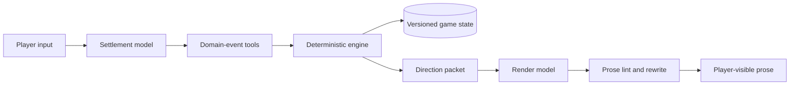

# fate-sandbox

[中文说明](README_ZH.md)

A local interactive narrative runtime for TYPE-MOON settings, built on the pi coding agent.

`fate-sandbox` treats the language model as an unreliable planner rather than a state store. A deterministic TypeScript engine validates domain events, advances time, protects hidden information, and records an auditable turn history. The model handles decisions and prose; the engine owns the game state.

> Experimental fan project. Fate and TYPE-MOON rights belong to their respective holders. See [License and fan-content notice](#license-and-fan-content-notice).

## Engineering overview

Each player turn runs through separate settlement and rendering passes:



The runtime enforces the boundaries that prompts cannot guarantee:

- **Domain events instead of raw patches.** Travel, wounds, purchases, secret reveals, scene beats, and offscreen actions enter through narrow tools with schema validation and engine invariants.
- **Auditable time.** Every canonical turn carries an elapsed-time or travel envelope and records its start and end timestamps.
- **Public and hidden state.** Public facts, protagonist knowledge, and hidden canonical facts remain separate. The renderer cannot reveal an unrevealed name or Noble Phantasm through prose alone.
- **Atomic settlement.** A failed event rejects the turn batch instead of leaving a partially updated world.
- **Versioned persistence.** Persisted state crosses schema versions through linear migrations before gameplay code can read it.
- **Isolated background workers.** The backstage director and showrunner audit run in engine-owned `pi -p` subprocesses. Their bare JSON output must pass engine schemas before the main runtime accepts it.
- **Recoverable interaction.** Rerendering preserves settled facts, while input rollback restores the matching state snapshot and removes the abandoned session branch.

The repository currently uses strict TypeScript, oxlint with type-aware rules, oxfmt, and a deterministic Node test suite. Run all four quality gates with:

```bash
pnpm typecheck && pnpm lint && pnpm format:check && pnpm test
```

### Repository map

| Path                      | Responsibility                                                                                     |
| ------------------------- | -------------------------------------------------------------------------------------------------- |
| `engine/core/`            | State, turns, scenes, actors, economy, memory, secrets, backstage work, and showrunner audit       |
| `engine/prompt-assembly/` | Settlement/render prompt assembly and preset loading                                               |
| `tools/`                  | GM-facing domain-event tools and world-data lookup                                                 |
| `prompts/settlement/`     | Settlement policy, world boundaries, tool routing, and direction contract                          |
| `prompts/render/`         | Rendering protocol, prose rules, and output contract                                               |
| `extensions/`             | pi UI panels, compaction policy, rerender/rollback integration, and audit lookup surface           |
| `skills/start-game/`      | New-game and character-creation state machine                                                      |
| `world-data/`             | Campaign presets and canonical TYPE-MOON fact skeletons                                            |
| `docs/adr/`               | Architecture decisions for state separation, two-pass rendering, ledgers, and subprocess isolation |

## Requirements

- Node.js 24 or later
- pnpm 11
- pi coding agent with a configured model provider

The game relies on disciplined tool calling. Choose a model that retries after actionable tool errors and does not skip tools when changing world state.

## Quick start

### Linux and macOS

```bash
pnpm install
./start.sh
```

### Windows PowerShell

```powershell
pnpm install
.\start.ps1
```

If PowerShell blocks the script, allow it for the current process:

```powershell
Set-ExecutionPolicy -Scope Process -ExecutionPolicy Bypass
.\start.ps1
```

Log in or configure a provider through your normal pi setup, then enter:

```text
/skill:start-game
```

You can also say “start game,” but the skill follows the full initialization flow.

## Playing

Common UI commands:

```text
/status      Show the current time, location, objectives, threats, and resources
/inventory   Show player-visible money and items
/compact     Compact the conversation with the Fate-specific policy
/reroll      Render the last settled turn again without changing state
/fuck [N]    Roll back to the input before the Nth most recent turn; default: 1
```

`/reroll` only repeats the rendering pass. It does not rerun settlement, advance time, or modify game state.

`/fuck` interrupts generation, restores the snapshot from before the selected input, removes the abandoned branch from the session file, and puts the original input back into the editor. Use pi's `/tree` instead when you want to keep both branches.

`/status` and `/inventory` open UI panels. They do not count as story actions.

## Worldlines

`/skill:start-game` can initialize 20 presets:

- **Fate Holy Grail conflicts:** _Fate/stay night_, _Fate/Zero_, _Fate/hollow ataraxia_, _Fate/strange Fake_, _Fate/Apocrypha_, _Fate/EXTRA_ and _EXTRA CCC_, _Fate/Prototype_, _Fate/Samurai Remnant_, and _Fate/type Redline_
- **Other Fate settings:** _The Case Files of Lord El-Melloi II_, _Fate/kaleid liner Prisma Illya_, and _Fate/Labyrinth_
- **Other TYPE-MOON settings:** original and remake _Tsukihime_, _The Garden of Sinners_, and _Witch on the Holy Night_
- **Special mode:** _Carnival Phantasm_
- **Custom:** choose the period, city, and conflict scale during setup

Presets provide a setting and canonical baseline. They do not force the original plot or protagonist.

### New to Fate?

Choose novice mode and enter as an ordinary person or outsider. The game introduces a term only when it affects your next decision; it does not use franchise terminology as an implicit puzzle prerequisite.

A low-complexity first setup:

```text
Fuyuki City, 2004. You are a student or temporary visitor with no knowledge of magecraft.
One evening, you see impossible light near an old storehouse.
```

## Settlement and render models

Settlement handles tool calls and rule adjudication. Rendering turns the validated direction packet into player-visible prose. You can assign a separate render model:

```bash
FATE_RENDER_MODEL=provider/model-id ./start.sh
```

Without `FATE_RENDER_MODEL`, both passes use the active settlement model. Invalid or unavailable model IDs produce a warning and fall back to that model.

Optional render controls:

```bash
FATE_RENDER_TEMPERATURE=0.9   # Only set this when the provider supports temperature
FATE_RENDER_CACHE=long        # Default: short; other value: none
```

The digest writer uses minimal reasoning on reasoning-capable models. Both main passes can also run at minimal reasoning because the tool sequence and direction packet externalize most decisions; raise settlement reasoning for complex combat or major reveals if packet quality drops.

The project has seen focused testing with GPT-5.5, Claude Opus 4.5, DeepSeek V4 Pro, and Gemini 3.1 Pro. Provider behavior and model quality change, so treat these as test coverage rather than compatibility guarantees.

## Prose lint

After rendering, the runtime scans for secret leakage, Markdown, stock AI openings, vague atmosphere phrases, report-like narration, and other configured patterns. It requests one rewrite on a match and shows a UI warning if the rewrite still fails.

Built-in rules and their prompt contracts live in:

```text
engine/audit/lint-rules.ts
prompts/render/style-blacklist.md
prompts/render/output-contract.md
```

Add private rules without changing source by creating the gitignored file `prompts/user/prose-lint.json`:

```json
{
  "rules": [
    { "id": "local-cliche", "scope": "anywhere", "pattern": "moonlight like water" },
    { "id": "no-opening-ah", "scope": "opening", "pattern": "^Ah" }
  ]
}
```

- `id`: starts with a lowercase letter and contains lowercase letters, digits, `-`, or `_`
- `scope`: `opening`, `ending`, `anywhere`, or `per-line`
- `pattern`: a JavaScript regular-expression string; the runtime adds the `g` and `u` flags

Local rules cannot disable the built-in blocks for unrevealed names and Noble Phantasms.

## Local data and testing

The first run creates an isolated pi configuration under `.pi/agent/`. Local authentication files, subprocess transcripts, sessions, and runtime state stay out of release packages.

- `sessions/` contains play sessions.
- `runtime/` contains state and debug exports. Per-call settlement and render contexts are written to `runtime/debug/` by default; set `FATE_DEBUG_API=0` to disable them.
- `.pi/agent/auth.json` contains local credentials. Do not share it.
- Backstage and showrunner subprocess sessions remain under the gitignored `.pi/agent/` tree.

Package a release with:

```bash
pnpm run pack:release
```

The archive appears under `dist/` and excludes dependencies, tests, local prompts, sessions, runtime state, development docs, and `.pi/agent/` data.

## License and fan-content notice

The engine, extensions, tools, and prompt framework use GPL-3.0-or-later. See [LICENSE](LICENSE).

The GPL does not cover `world-data/`. That directory contains fan-maintained setting data derived from Fate and TYPE-MOON works. TYPE-MOON and the respective rights holders retain all rights to that material. The project provides it only for non-commercial fan use; see [world-data/NOTICE.md](world-data/NOTICE.md).
